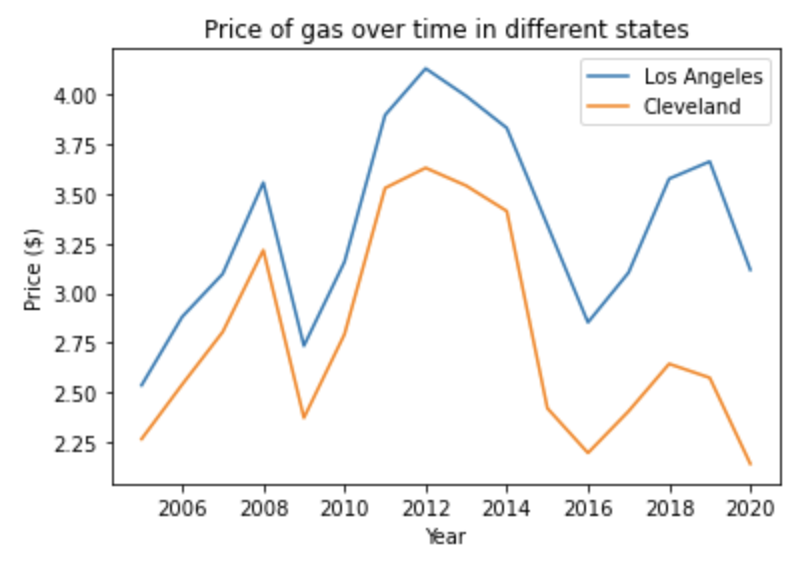
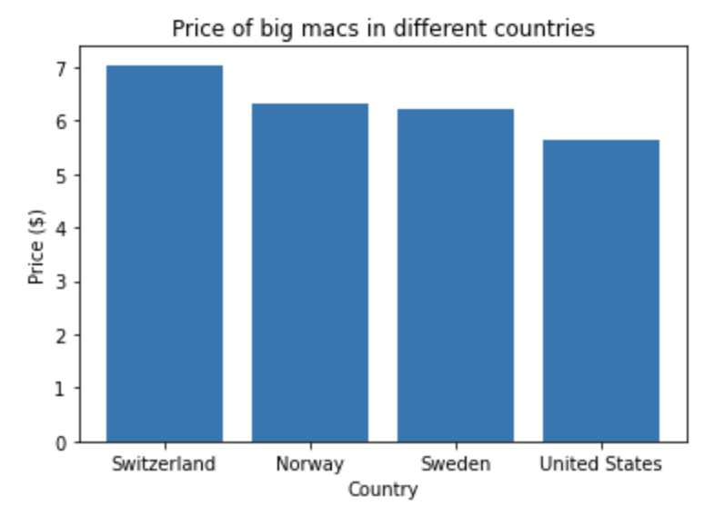

# Price variation of goods in different countries
## Price of gas in Cleveland and Los Angeles between 2005-2020

This graph shows the relationship between the price of gas per gallon and the year. The graph compares the price of gas in Los Angles with the price of gas in Cleveland. The data shows that between 2005 and 2020 the price of gas in Los Angeles has always been higher. Between 2008 and 2009, during the financial crisis,the difference in price was the lowest. This data was sourced from [eia.gov](https://www.eia.gov/dnav/pet/pet_pri_gnd_a_epm0_pte_dpgal_a.html).

## Price of a big mac in USD in four countries

This graph compares the price of big macs in Switzerland, Sweden, Norway, and the USA. The bar graphs indicate that in the data set, the price of a big mac in USD is higher in scandanavian countries than in the USA. This data was sourced from [Statistica](https://www.statista.com/statistics/274326/big-mac-index-global-prices-for-a-big-mac/).

A link to this [project's instructions](https://github.com/mikeizbicki/cmc-csci040/tree/2021fall/hw_02)

